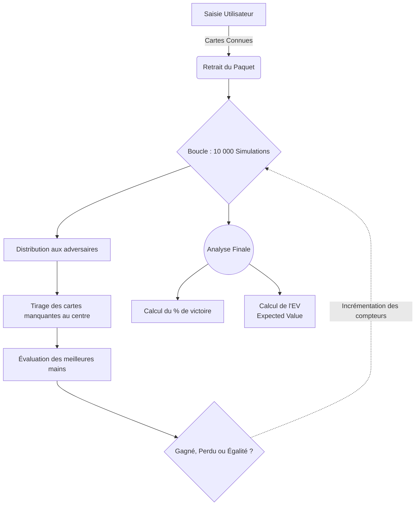

# 🃏 Poker Stats & EV Calculator

Bienvenue dans la documentation du **Calculateur de Poker : Probabilités & Expected Value (EV)**.  
Ce logiciel vous permet de calculer instantanément vos chances de victoire au Texas Hold'em et de savoir si vos mises sont mathématiquement rentables.

---

## 🚀 1. Installation & Lancement

L'application utilise l'interface native de Python (`tkinter`) et un moteur d'évaluation de mains très puissant (`treys`).

**Prérequis :** Installer le moteur algorithmique
```bash
pip install treys
```

**Démarrer l'interface graphique :**
```bash
python poker_gui.py
```

---

## 🎨 2. Guide Visuel de l'Interface

Voici comment remplir les champs de l'application :

| Champ | Description | Exemple Visuel |
| :--- | :--- | :--- |
| **Votre main** | Entrez exactement 2 cartes séparées par un espace. | `Ah Ks` *(As de ♥, Roi de ♠)* |
| **Table** *(Optionnel)* | Entrez 0, 3 (Flop), 4 (Turn) ou 5 (River) cartes. | `2h 7s Td` *(2♥, 7♠, 10♦)* |
| **Adversaires** | Le nombre de joueurs face à vous (1 à 8). | `2` |
| **SB / BB** | Petite blinde et Grosse Blinde actuelle. | `1` et `2` |

### 🎴 Code des Cartes
Chaque carte s'écrit en **2 lettres** (Valeur + Famille) :
* **Valeurs :** `2, 3, 4, 5, 6, 7, 8, 9, T (pour 10), J, Q, K, A`
* **Familles (Couleurs) :** 
  * `s` (Spades) = ♠ Pique
  * `h` (Hearts) = ♥ Cœur
  * `d` (Diamonds) = ♦ Carreau
  * `c` (Clubs) = ♣ Trèfle

---

## ⚙️ 3. Comment fonctionne l'algorithme ? (Simulation Monte-Carlo)

L'application n'utilise pas de simples bases de données statiques. Elle **joue littéralement 10 000 parties virtuelles** en arrière-plan pour calculer vos probabilités réelles.



---

## 💰 4. Comprendre l'Indicateur "EV" (Expected Value)

Le logiciel ne vous donne pas qu'un pourcentage. Il calcule un concept clé pour les joueurs de poker pro : l'**EV**. 
Il simule un cas où vous relanceriez de **3 fois la grosse blinde**.

* 🟢 **ACTION RENTABLE (EV+) :** Vos chances de victoires sont suffisantes pour couvrir les pertes potentielles. Sur le long terme, faire cette mise avec cette main **vous fera gagner de l'argent**.
* 🔴 **ACTION DÉFICITAIRE (EV-) :** Mathématiquement, l'argent investi dans le pot est trop important par rapport à vos chances de le remporter. Vous **perdrez de l'argent sur le long terme**.

---

## 💡 5. Exemple Pratique de Situation

Vous recevez une paire de Rois servis (`Ks Kh`). Vous faites face à 2 adversaires.
1. Vous tapez `Ks Kh` dans *Votre main*.
2. Vous laissez le champ *Table* **vide** (actions pre-flop).
3. Vous cliquez sur "Calculer".

**Résultat :** Vos cartes s'affichent graphiquement sur le tapis vert, et le logiciel vous indique que votre taux de victoire approche les ~50%-55% face à 2 joueurs incertains. Votre **EV sera fortement au vert**, vous indiquant d'être agressif !